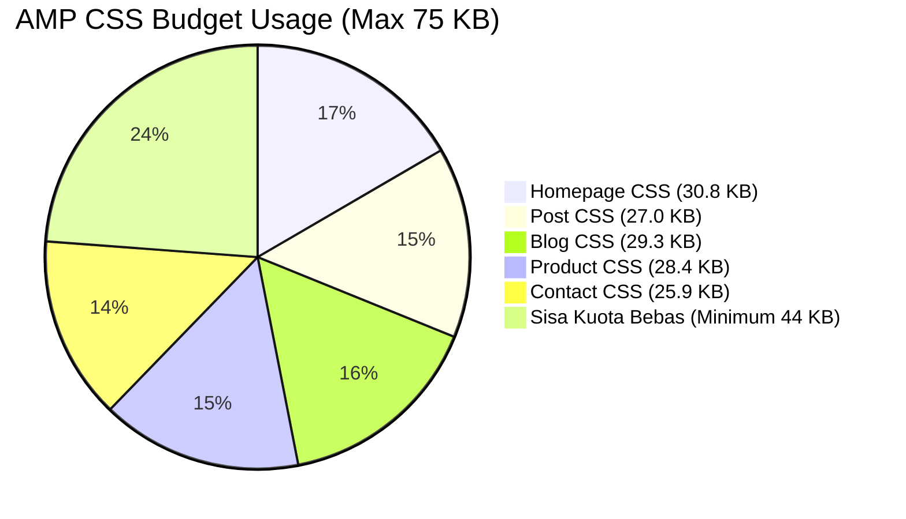

# GOOGLE AMP HTML SPECIFICATION & VALIDATION STANDARDS
## Adarent CMS & Tran99.com AMP Compliance Architecture

**Version:** 1.0.0  
**Authority:** [Google AMP Project Guidelines](https://amp.dev/)  
**Primary Constraint:** Public frontend MUST remain 100% valid AMP HTML. Zero custom JavaScript outside AMP framework.

---

## 1. Core Principles of AMP Compliance

1. **AMP Runtime Mandat:** Seluruh dokumen HTML publik wajib diawali dengan tanda kilat `<html ⚡ lang="id">` atau `<html amp lang="id">`.
2. **Strict CSS Quota:** Hanya satu tag `<style amp-custom>` yang diizinkan per halaman dengan ukuran absolut **kurang dari 75.000 bytes (75 KB)**.
3. **No Arbitrary JavaScript:** Tag `<script>` pengguna dan pustaka pihak ketiga (seperti jQuery, Bootstrap JS, React) **DILARANG KERAS** pada halaman publik.
4. **Asynchronous Component Loading:** Seluruh ekstensi AMP di-load secara asinkron dengan atribut `async` dan `custom-element`.
5. **Static Layout Sizing:** Setiap aset visual (`amp-img`, `amp-iframe`, dll) wajib memiliki atribut dimensi eksplisit (`width`, `height`, dan `layout`) untuk mencegah Cumulative Layout Shift (CLS).

---

## 2. Authorized AMP Component Registry

Berikut adalah daftar resmi komponen AMP yang digunakan pada Tran99.com:

| Komponen AMP | File Include | Skrip Runtime | Kegunaan Utama |
| :--- | :--- | :--- | :--- |
| **`amp-img`** | Bawaan v0.js | `cdn.ampproject.org/v0.js` | Gambar armada, foto dokumentasi, thumbnail artikel |
| **`amp-sidebar`** | `amp-sidebar.html` | `amp-sidebar-0.1.js` | Menu navigasi drawer mobile kanan |
| **`amp-form`** | `amp-form.html` | `amp-form-0.1.js` | Form pencarian dan tombol reset navigasi sidebar |
| **`amp-iframe`** | `amp-iframe.html` | `amp-iframe-0.1.js` | Embed Google Maps interaktif pada halaman kontak |
| **`amp-instagram`** | `amp-instagram.html`| `amp-instagram-0.1.js` | Embed feed galeri foto pelanggan di `/gallery/` |
| **`amp-tiktok`** | `amp-tiktok.html` | `amp-tiktok-0.1.js` | Embed video dokumentasi armada di `/gallery/` |
| **`amp-install-serviceworker`** | `footer.html` | `amp-install-serviceworker-0.1.js` | Registrasi Workbox Service Worker PWA |

---

## 3. Inline CSS Budget & Optimization Guidelines

### 3.1 Status Anggaran CSS Kustom Saat Ini



### 3.2 Aturan Penulisan CSS untuk AMP:
- **Dilarang keras:** Penggunaan `@import` eksternal di dalam `<style amp-custom>`.
- **Dilarang keras:** Tag `<link rel="stylesheet">` untuk file CSS eksternal (seluruh CSS wajib inline di dalam `<style amp-custom>`).
- **Dilarang:** Menggunakan properti CSS yang memicu layout recalculation berat (misal: animasi `width`, `height`, `top`, `left`). Gunakan hanya `transform` dan `opacity`.
- **Peringatan File Lama:** File `_includes/amp-custom-asli.html` (382 KB) adalah file arsip mati. **DILARANG DIGUNAKAN KEMBALI** karena melanggar batas 75 KB sebesar 509%.

---

## 4. AMP Validation Workflow & Automation

### 4.1 Alat Pengujian Otomatis
Pengujian validasi AMP dijalankan menggunakan library resmi Google `@ampproject/toolbox-validator` atau `amphtml-validator` via Node.js:

```javascript
// Cuplikan scripts/validate-amp.js
const amphtmlValidator = require('amphtml-validator');
const fs = require('fs');

async function validateFile(filePath) {
  const validator = await amphtmlValidator.getInstance();
  const html = fs.readFileSync(filePath, 'utf8');
  const result = validator.validateString(html);
  if (result.status === 'PASS') {
    console.log(`[PASS] ${filePath}`);
    return true;
  } else {
    for (let ii = 0; ii < result.errors.length; ii++) {
      const error = result.errors[ii];
      console.error(`[FAIL] ${filePath}:${error.line}:${error.col} ${error.message}`);
    }
    return false;
  }
}
```

### 4.2 Quality Gate Checklist Validasi AMP:
1. [ ] Seluruh halaman statis (`/`, `/blog/`, `/contact/`, `/gallery/`, `/product/`) berstatus **PASS**.
2. [ ] Sampel representatif 10 artikel dari tahun 2018 hingga 2026 berstatus **PASS**.
3. [ ] Ukuran `<style amp-custom>` seluruh halaman terverifikasi di bawah 50 KB.
4. [ ] Tidak ditemukan atribut HTML terlarang atau tag script liar di dalam DOM artikel.
