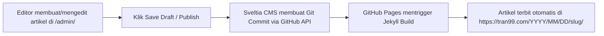

# ADARENT CMS SPECIFICATION
## Git-Based Content Management Layer for Tran99.com

**Version:** 1.0.0  
**Selected Engine:** Sveltia CMS (Modern Decap CMS Successor)  
**Mount Path:** `/admin/`  
**Hosting Model:** 100% Client-Side SPA (Static Single Page Application)  
**Core Directive:** Jangan mengubah Adarent CMS menjadi backend aplikasi kompleks jika kebutuhan dapat dipenuhi dengan Git-based CMS.

---

## 1. CMS Architecture & Feasibility Evaluation

### 1.1 Hasil Evaluasi Kelayakan (Feasibility Study)
| Solusi Potensial | Bobot Backend | Resiko Terhadap Jekyll & AMP | Kemudahan Operasional | Keputusan |
| :--- | :--- | :--- | :--- | :--- |
| **Custom Node/Express Backend** | Berat (butuh database, VPS, server maintenance) | Tinggi (potensi konflik routing, biaya bulanan) | Sedang | **REJECTED** |
| **WordPress / Headless WP** | Sangat Berat (butuh PHP/MySQL terpisah) | Ekstrem (duplikasi CMS & desinkronisasi git) | Rendah | **REJECTED** |
| **Decap CMS (Netlify CMS)** | Nol (Client-side JS) | Rendah, namun codebase tua (React 16, unmaintained) | Baik | **BACKUP** |
| **Sveltia CMS** | Nol (Client-side JS murni, dibangun dengan Svelte) | Nol (sepenuhnya terisolasi di `/admin/`, output Markdown) | **Sangat Baik & Modern** | **SELECTED** |

### 1.2 Kesimpulan Pemilihan Sveltia CMS
Sveltia CMS adalah solusi ideal untuk Adarent CMS karena:
1. Membaca format konfigurasi standar `admin/config.yml`.
2. Berjalan langsung di browser tanpa memerlukan server auth eksternal jika menggunakan GitHub Personal Access Token (PAT), atau dapat menggunakan lightweight OAuth backend.
3. Menghasilkan commit Git yang bersih langsung ke branch GitHub, sehingga riwayat perubahan (*audit trail*) transparan 100%.
4. Halaman `/admin/` tidak mengganggu dan tidak membatalkan status AMP pada frontend publik.

---

## 2. Directory Structure & Admin Routing

```
projecttran99.github.io/
└── admin/
    ├── index.html        # Sveltia CMS runtime SPA loader
    └── config.yml        # Deklarasi koleksi, schema, dan field Adarent CMS
```

### 2.1 File `admin/index.html`
```html
<!DOCTYPE html>
<html lang="id">
<head>
  <meta charset="utf-8" />
  <meta name="viewport" content="width=device-width, initial-scale=1.0" />
  <title>Adarent CMS | Tran99.com Dashboard</title>
  <link rel="icon" href="/favicon.ico" />
  <script src="https://unpkg.com/@sveltia/cms/dist/sveltia-cms.js"></script>
</head>
<body>
</body>
</html>
```

---

## 3. Collections & Schema Definitions (`admin/config.yml`)

Berikut skema konfigurasi koleksi konten Adarent CMS:

```yaml
backend:
  name: github
  repo: projecttran99/projecttran99.github.io
  branch: master # atau development branch saat pengujian

media_folder: "photos"
public_folder: "/photos"

collections:
  # 1. Koleksi Artikel Blog (58 artikel existing)
  - name: "posts"
    label: "Artikel Blog"
    folder: "_posts"
    create: true
    slug: "{{year}}-{{month}}-{{day}}-{{slug}}"
    editor:
      preview: false
    fields:
      - { label: "Layout", name: "layout", widget: "hidden", default: "post" }
      - { label: "Judul Artikel (Title)", name: "title", widget: "string", required: true }
      - { label: "Judul Tampilan (Text Title)", name: "text-title", widget: "string", required: true }
      - { label: "Penulis (Writer)", name: "writer", widget: "string", default: "Denny Rakhmad Widi Ashari" }
      - { label: "Meta Deskripsi SEO", name: "description", widget: "text", required: true }
      - { label: "Foto Utama (Photos URL)", name: "photos", widget: "image", required: true }
      - { label: "AMP Image Source", name: "amp-img-scr", widget: "image", required: true }
      - { label: "AMP Image Alt Text", name: "amp-img-alt", widget: "string", required: true }
      - { label: "AMP Image Width", name: "amp-img-width", widget: "number", default: 550 }
      - { label: "AMP Image Height", name: "amp-img-height", widget: "number", default: 309 }
      - { label: "AMP Image Layout", name: "amp-img-layout", widget: "hidden", default: "responsive" }
      - { label: "Konten Artikel", name: "body", widget: "markdown", required: true }

  # 2. Koleksi Armada Mobil (Katalog Sewa)
  - name: "products"
    label: "Armada Mobil (Tarif Sewa)"
    folder: "_data-products"
    create: true
    slug: "{{slug}}"
    fields:
      - { label: "Nama Mobil", name: "text-title", widget: "string", required: true }
      - { label: "Foto Mobil", name: "amp-img-scr", widget: "image", required: true }
      - { label: "Alt Text Foto", name: "amp-img-alt", widget: "string", required: true }
      - { label: "Lebar Foto", name: "amp-img-width", widget: "number", default: 165 }
      - { label: "Tinggi Foto", name: "amp-img-height", widget: "number", default: 165 }
      - { label: "Layout Gambar", name: "amp-img-layout", widget: "hidden", default: "fixed" }
      - { label: "Fasilitas 1", name: "list-1", widget: "string", default: "Termasuk Driver." }
      - { label: "Fasilitas 2", name: "list-2", widget: "string", default: "Pemakaian Area Surabaya." }
      - { label: "Fasilitas 3", name: "list-3", widget: "string", default: "Pemakaian Luar Kota [Call]." }
      - { label: "Tarif Sewa (Price)", name: "price", widget: "string", required: true }

  # 3. Koleksi Pengaturan Halaman Utama
  - name: "settings"
    label: "Pengaturan Kontak & Brand"
    files:
      - label: "Konfigurasi Global Website"
        name: "config"
        file: "_config.yml"
        fields:
          - { label: "Nama Perusahaan", name: "company", widget: "string" }
          - { label: "Nomor Telepon", name: "telephone", widget: "string" }
          - { label: "Nomor Tampilan Telepon", name: "telephonedetail", widget: "string" }
          - { label: "Alamat Kantor", name: "streetAddress", widget: "string" }
          - { label: "Kota & Wilayah", name: "address", widget: "string" }
          - { label: "Kode Pos", name: "postalCode", widget: "string" }
```

---

## 4. Editorial Workflow (Draft & Publish Flow)



### Karakteristik Editorial Flow:
1. **Preservasi Format Otomatis:** Sveltia CMS secara konsisten menulis file Markdown dengan YAML frontmatter yang persis sama dengan 58 artikel lama (`amp-img-scr`, `text-title`, `photos`, dll).
2. **Media Handling:** Gambar yang di-upload otomatis masuk ke direktori `photos/` dan di-commit bersamaan dengan artikel, menjaga agar jalur gambar tidak pernah rusak.
3. **Pemberitahuan Otomatis:** Perubahan tercatat dalam Git log GitHub sehingga pemilik bisnis selalu dapat melakukan audit riwayat siapa yang mempublikasikan konten.
