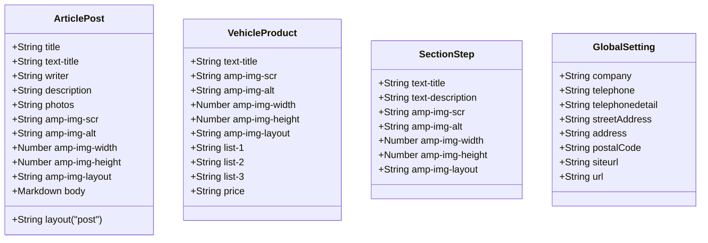

# CONTENT MODEL SPECIFICATION
## Data Structures, Schemas, and Liquid Mapping for Adarent CMS / Tran99.com

**Version:** 1.0.0  
**Data Formats:** YAML Frontmatter + Markdown Body + Jekyll Data Collections  

---

## 1. Content Entities Overview

Arsitektur konten Tran99.com dibagi menjadi 4 kelompok entitas data:



---

## 2. Article Post Model (`_posts/YYYY-MM-DD-slug.md`)

Mewakili 58 artikel blog berbobot SEO yang telah terbit.

### 2.1 Skema Frontmatter & Validasi
| Field | Tipe Data | Wajib | Nilai Default / Contoh | Deskripsi & Kegunaan |
| :--- | :--- | :--- | :--- | :--- |
| `layout` | String | Ya | `post` | Layout Jekyll yang digunakan (`_layouts/post.html`) |
| `title` | String | Ya | `Beejay Bakau Resort` | Judul dokumen untuk `<title>` tag & Open Graph |
| `text-title` | String | Ya | `Beejay Bakau Resort` | Judul artikel untuk tampilan visual `<h1>` |
| `writer` | String | Ya | `Denny Rakhmad Widi Ashari` | Nama penulis / reviewer artikel |
| `description` | String | Ya | `Beejay Bakau Resort... Hubungi 081-330-548-581` | Meta deskripsi SERP (maks 155 karakter) |
| `photos` | String (URL) | Ya | `https://media-cdn...` atau `/photos/sample.jpg` | Gambar utama untuk Open Graph / Twitter Card |
| `amp-img-scr` | String (URL) | Ya | `https://media-cdn...` atau `/photos/sample.jpg` | Sumber gambar untuk komponen `<amp-img>` |
| `amp-img-alt` | String | Ya | `beejay bakau resort rental mobil surabaya` | Atribut ALT gambar untuk aksesibilitas & SEO |
| `amp-img-width` | Number | Ya | `550` | Lebar intrinsik gambar untuk AMP layout |
| `amp-img-height`| Number | Ya | `309` | Tinggi intrinsik gambar untuk AMP layout |
| `amp-img-layout`| String | Ya | `responsive` | Tipe tata letak AMP (`responsive`, `fixed`) |

### 2.2 Template Mapping (Liquid)
```liquid
<!-- _layouts/post.html -->
<div class="vs-section-title text-center">
    <h1><span class="text-title">{{ page.text-title }}</span></h1>
    <h5><span class="post">Writer : {{ page.writer }}</span></h5>
</div>
<div class="small-12 medium-8 cell">
    <amp-img class="post" 
             src="{{ page.amp-img-scr }}" 
             width="{{ page.amp-img-width }}" 
             height="{{ page.amp-img-height }}" 
             layout="{{ page.amp-img-layout | default: 'responsive' }}" 
             alt="{{ page.amp-img-alt }}">
    </amp-img>
</div>
<div class="post-content">
    {{ content }}
</div>
```

---

## 3. Vehicle Product Model (`_data-products/*.md`)

Mewakili katalog armada mobil sewa di `/product/`.

### 3.1 Skema Frontmatter
```yaml
---
amp-img-scr: /static/avanza.jpg
amp-img-width: 165
amp-img-height: 165
amp-img-layout: fixed
amp-img-alt: avanza rental mobil surabaya
text-title: Avanza
list-1: Termasuk Driver.
list-2: Pemakaian Area Surabaya.
list-3: Pemakaian Luar Kota [Call].
price: Rp. 400.000
---
```

### 3.2 Template Mapping (Liquid)

```liquid
<!-- product.html -->

<div class="small-12 large-6 cell">
    <div class="vs-box-product-list">
        <amp-img src="{{ item.amp-img-scr }}" width="{{ item.amp-img-width }}" height="{{ item.amp-img-height }}" layout="{{ item.amp-img-layout }}" alt="{{ item.amp-img-alt }}"></amp-img>
        <h3 class="text-title">{{ item.text-title }}</h3>
        <ul>
            <li>{{ item.list-1 }}</li>
            <li>{{ item.list-2 }}</li>
            <li>{{ item.list-3 }}</li>
        </ul>
        <div class="rent-price">
            <h5>{{ item.price }}</h5>
        </div>
    </div>
</div>

```


---

## 4. Landing Page Modular Section Models

1. **`_data-section-3` (Cara Memesan):**
   - Fields: `amp-img-scr`, `amp-img-width`, `amp-img-height`, `amp-img-layout`, `amp-img-alt`, `text-title`, `text-description`.
   - Entri: `hubungi-kami.md`, `jadwal.md`, `bayar.md`, `jemput.md`.
2. **`_data-section-5` (Keunggulan Layanan):**
   - Entri: `terpercaya.md`, `tepat-waktu.md`, `murah.md`, `Ramah.md`.
3. **`_data-section-7` (Media Sosial):**
   - Entri: `facebook.md`, `instagram.md`, `tiktok.md`, `twitter.md`, `youtube.md`.
4. **`_data-section-9` (Kontak Operasional):**
   - Entri: `alamat.md`, `email.md`, `phone.md`, `whatsapp.md`, `whatsapp-admin.md`.

---

## 5. Global Settings Model (`_config.yml`)

Mewakili konfigurasi global yang dapat diakses melalui objek Liquid `{{ site.* }}`:

| Kunci Konfigurasi | Tipe Data | Nilai Saat Ini | Penggunaan |
| :--- | :--- | :--- | :--- |
| `title` | String | `Rental Mobil Surabaya` | Default title prefix |
| `company` | String | `Tran99.com` | Brand signature |
| `siteurl` | String | `https://tran99.com` | Domain URL produksi |
| `url` | String | `https://tran99.com` | Wajib ditambahkan untuk kompatibilitas jekyll-feed & sitemap |
| `telephone` | String | `+6281330548581` | Nomor telepon internasional |
| `telephonedetail`| String | `081-330-548-581` | Nomor tampilan lokal |
| `streetAddress` | String | `Jalan Joyoboyo Kav C No 17` | Jalan alamat fisik |
| `address` | String | `Medaeng Waru Sidoarjo...` | Wilayah kota |
| `postalCode` | String | `61256` | Kode pos |
