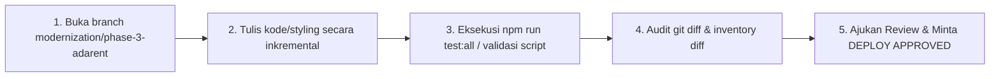

# CONTRIBUTING GUIDELINES
## Developer & Engineer Contribution Policy for Adarent CMS / Tran99.com

**Version:** 1.0.0  
**Core Motto:** Safe Upgrade, Not Rebuild from Zero  

---

## 1. General Principles

Terima kasih telah berkontribusi pada pengembangan modernisasi **Tran99.com** dan **Adarent CMS**. Repositori ini melayani bisnis rental mobil aktif dengan 58 artikel blog terindeks dan SEO equity yang sangat bernilai sejak 2018.

Sebelum Anda mulai menulis kode, harap pahami bahwa stabilitas dan proteksi aset existing adalah prioritas nomor satu.

---

## 2. The Seven Non-Negotiable Rules

1. **JANGAN PERNAH** menghapus artikel existing di `_posts/`.
2. **JANGAN PERNAH** mengubah pola permalink `/:year/:month/:day/:slug/`.
3. **JANGAN PERNAH** me-rename atau memindahkan gambar existing di `photos/` atau `static/`.
4. **JANGAN PERNAH** menyuntikkan script JavaScript sembarangan ke template publik yang merusak validasi Google AMP HTML.
5. **JANGAN PERNAH** melakukan commit atau push langsung ke branch `master`.
6. **JANGAN PERNAH** melakukan `git push --force`.
7. **SELALU** jalankan build lokal dan validasi inventaris sebelum mengajukan review.

---

## 3. Contribution Workflow



### Langkah-Langkah:
1. Pastikan Anda berada pada development branch:
   ```bash
   git checkout -b modernization/phase-3-adarent
   ```
2. Buat perubahan kecil yang terukur.
3. Jalankan pengujian dan build:
   ```bash
   jekyll build
   node scripts/generate-inventory.js
   node scripts/validate-diff.js
   ```
4. Periksa `git diff` untuk memastikan tidak ada spasi atau baris yang terhapus secara tidak disengaja.
5. Mintalah persetujuan eksplisit dari Technical Lead / Klien sebelum proses rilis produksi dijalankan.

---

## 4. Code Standards

- **Liquid Templates:** Gunakan indentasi 4 spasi yang bersih. Berikan fallback Liquid jika nilai frontmatter berpotensi kosong (`{{ page.title | default: page.text-title }}`).
- **AMP CSS:** Tulis CSS yang efisien dan modular. Selalu periksa ukuran `<style amp-custom>` agar tidak melebihi kuota 50 KB.
- **Commit Messages:** Ikuti spesifikasi Conventional Commits (`feat:`, `fix:`, `docs:`, `style:`, `refactor:`, `test:`).
