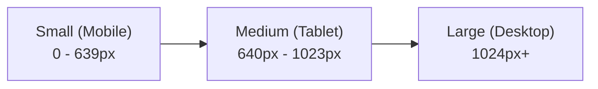

# DESIGN SPECIFICATION (DESIGN.md)
## Adarent CMS & Tran99.com Visual Modernization Layer

**Version:** 1.0.0  
**Framework:** Clean AMP-Compliant CSS Architecture (Mobile-First)  
**Standard:** WCAG 2.1 AA Compliant  

---

## 1. Existing Design Analysis & Preservation Principles

### 1.1 Analisis Desain Existing
- **Basis Grid:** Menggunakan Foundation Grid (`grid-container`, `grid-x`, `grid-padding-x`, `cell`, `small-12`, `medium-6`, `large-4`).
- **Palet Warna Asli:**
  - Biru Dominan Primer: `#3399ff` (diatur pada theme-color)
  - Secondary: `#ffcc00` / nuansa kuning cerah
  - Background Neutral: `#f8f9fa` (smoke / lightgrey)
  - Text: `#333333` dan `#222222`
- **Kelemahan Existing:**
  - Hirarki tipografi belum konsisten (halaman post menggunakan `<h3>` untuk judul utama).
  - Tampilan kartu produk dan artikel agak kaku dengan bayangan tajam model 2018.
  - Floating WhatsApp button desktop/mobile memiliki styling terpisah yang berpotensi layout shift.
  - Kurangnya visual breadcrumb dan navigasi paginasi yang nyaman di layar sentuh.

### 1.2 Prinsip Preservasi Desain (Design Preservation Principles)
1. **Identitas Brand:** Pertahankan warna biru khas Tran99 yang telah diakui oleh pelanggan setia.
2. **Keterbacaan Konten:** Artikel blog yang telah ada tidak diubah format paragrafnya (`<p class="post">`), melainkan diperindah melalui CSS line-height dan letter-spacing modern.
3. **AMP CSS Strict Limit:** Seluruh stylesheet yang dihasilkan wajib tetap berada di bawah 50 KB (batas Google AMP adalah 75 KB).
4. **No External Fonts Render Blocking:** Menggunakan modern system typography stack atau preload font standar tanpa memicu FOIT/CLS.

---

## 2. Design System & Tokens

### 2.1 Color Palette

```
  Primary Blue          Secondary Accent      Dark Neutral          Light Surface         White
  [ #1976D2 ]             [ #FFA000 ]           [ #1E293B ]           [ #F8FAFC ]         [ #FFFFFF ]
  --color-primary        --color-accent        --color-text-main     --color-bg-light    --color-surface
```

| Token CSS | Nilai HEX / HSL | Penggunaan | Rasio Kontras (vs Putih) |
| :--- | :--- | :--- | :--- |
| `--color-primary` | `#1976D2` | Header, Brand Logo, CTA Utama, Link | 4.6:1 (Pass AA) |
| `--color-primary-dark`| `#0D47A1` | Hover state tombol primer | 8.8:1 (Pass AAA) |
| `--color-accent` | `#FFA000` | Badge promo, highlight harga | 4.5:1 (dengan teks gelap) |
| `--color-whatsapp` | `#25D366` | Tombol CTA WhatsApp Float | 4.5:1 (dengan teks gelap) |
| `--color-text-main` | `#1E293B` | Paragraf, judul teks, body | 13.5:1 (Pass AAA) |
| `--color-text-muted`| `#64748B` | Tanggal posting, writer meta, subtitle | 5.2:1 (Pass AA) |
| `--color-bg-light` | `#F8FAFC` | Latar belakang seksi selang-seling | Neutral Background |
| `--color-border` | `#E2E8F0` | Garis pembatas kartu, breadcrumb | Neutral Border |

### 2.2 Modern Typography System

Menggunakan modern system font stack berkecepatan tinggi tanpa penalti latensi font eksternal:

```css
:root {
  --font-sans: -apple-system, BlinkMacSystemFont, "Segoe UI", Roboto, "Helvetica Neue", Arial, sans-serif;
  --font-heading: "Segoe UI", -apple-system, BlinkMacSystemFont, Roboto, sans-serif;
}
```

| Tingkat | Ukuran (Mobile) | Ukuran (Desktop) | Weight | Line Height |
| :--- | :--- | :--- | :--- | :--- |
| **Hero Title / H1** | 24px (1.5rem) | 34px (2.125rem) | 800 | 1.25 |
| **Section Title / H2**| 20px (1.25rem) | 26px (1.625rem) | 700 | 1.3 |
| **Card Title / H3** | 17px (1.0625rem)| 19px (1.1875rem) | 600 | 1.35 |
| **Body Text** | 15px (0.9375rem)| 16px (1rem) | 400 | 1.65 |
| **Caption / Meta** | 12px (0.75rem) | 13px (0.8125rem) | 500 | 1.4 |

---

## 3. Layout, Spacing & Breakpoints

### 3.1 Breakpoints Responsif



- **Small (Default Mobile-First):** `max-width: 639px` (1 kolom pada daftar produk & artikel).
- **Medium (Tablet):** `min-width: 640px` (2 kolom pada kartu produk & artikel).
- **Large (Desktop):** `min-width: 1024px` (Container max 1140px, navigasi horizontal penuh).

### 3.2 Spacing System (T-Shirt Scale)
- `--space-xs`: `4px`
- `--space-sm`: `8px`
- `--space-md`: `16px`
- `--space-lg`: `24px`
- `--space-xl`: `32px`
- `--space-2xl`: `48px`

---

## 4. Component Design Specifications

### 4.1 Header & Mobile Navigation (`amp-sidebar`)
- **Desktop:** Logo Tran99 elegan di sebelah kiri, menu horizontal di kanan (`Harga`, `Galeri`, `Info`, `Hubungi Kami`), disertai tombol kontak cepat.
- **Mobile:** Fixed top bar yang ramping, tombol burger tap (`on="tap:sidebar.toggle"`) dengan `amp-sidebar` modern di sebelah kanan. Dilengkapi ikon menu bersih dan tautan langsung ke WhatsApp, telepon, dan SMS.

### 4.2 Article / Post Layout (`_layouts/post.html`)
- **Breadcrumb Navigasi:** Di atas judul: `Beranda > Info > [Judul Artikel]`.
- **Title Block:** Menggunakan elemen `<h1>` semantik, warna `--color-text-main`, ukuran responsif.
- **Meta Block:** Informasi penulis (`page.writer`), tanggal posting (`page.date`), dan estimasi waktu baca.
- **Featured Image:** Komponen `<amp-img layout="responsive">` dengan rasio 16:9 yang tajam dan memiliki `alt` deskriptif.
- **Content Flow:** Paragraf dengan padding vertikal seimbang (`margin-bottom: 1.25rem`), warna teks kontras tinggi, dan tautan internal yang jelas dengan underline dekoratif halus.
- **Bottom CTA Banner:** Kotak rekomendasi sewa mobil relevan di akhir artikel dengan tombol WhatsApp one-click inquiry.

### 4.3 Product Card System (`product.html`)
- Desain kartu bergaya modern elevasi lembut (`box-shadow: 0 4px 12px rgba(0,0,0,0.06)`).
- Menampilkan:
  - Foto armada mobil beresolusi tinggi (`amp-img`).
  - Nama armada (Avanza, Innova Reborn, Fortuner VRZ, Hiace, dll).
  - Poin fasilitas: Driver ramah, BBM, area Surabaya / Luar Kota.
  - Badge harga terkemas jelas dengan warna latar kontras.
  - Tombol aksi *"Sewa Sekarang"* yang langsung membuka tautan WhatsApp API dengan pesan pre-filled: `Halo Tran99, saya ingin reservasi [Nama Armada]`.

### 4.4 Breadcrumb Component
- Mengikuti pola visual:
  ```html
  <nav class="breadcrumb-container" aria-label="Breadcrumb">
    <ol class="breadcrumb-list">
      <li><a href="/">Beranda</a></li>
      <li><a href="/blog/">Info</a></li>
      <li aria-current="page">{{ page.text-title }}</li>
    </ol>
  </nav>
  ```
- Disertai schema JSON-LD `BreadcrumbList` yang sinkron 100%.

### 4.5 Floating Action Button (CTA)
- Ditempatkan di sudut kanan bawah layar (`position: fixed; bottom: 20px; right: 20px; z-index: 9999;`).
- Menghubungkan langsung ke `https://api.whatsapp.com/send?phone=6281330548581&text=Hallo%20Tran99,%20saya%20mau%20sewa%20mobil`.
- Menggunakan ikon WhatsApp SVG yang tajam dan pulse micro-animation ringan yang tidak memicu CLS (Cumulative Layout Shift).

---

## 5. AMP CSS Architecture & Budget Control

| Halaman | File CSS Include | Kuota Maksimal | Target Pasca Modernisasi | Status |
| :--- | :--- | :--- | :--- | :--- |
| **Homepage** | `amp-custom-home.html` | 75 KB | < 35 KB | Sangat Aman |
| **Post (Artikel)** | `amp-custom-post.html` | 75 KB | < 32 KB | Sangat Aman |
| **Blog (Daftar)** | `amp-custom-blog.html` | 75 KB | < 32 KB | Sangat Aman |
| **Product (Harga)** | `amp-custom-product.html` | 75 KB | < 32 KB | Sangat Aman |
| **Gallery** | `amp-custom-gallery.html` | 75 KB | < 30 KB | Sangat Aman |
| **Contact** | `amp-custom-contact.html` | 75 KB | < 30 KB | Sangat Aman |

### Aturan Ketat AMP Styling:
1. `!important` diminimalisir hanya untuk utilitas mutlak.
2. Tidak boleh menggunakan CSS selector yang dilarang AMP (seperti `*` berlebih atau universal reset yang berat).
3. Transisi hanya pada properti `transform` dan `opacity` untuk menjamin render 60 FPS di perangkat mobile.
