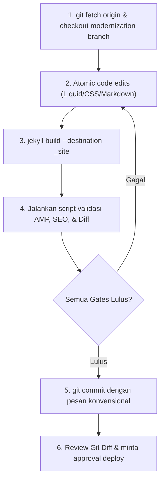

# LOCAL DEVELOPMENT WORKFLOW & OPERATIONAL RUNBOOK
## Engineer & Agent Development Handbook for Adarent CMS / Tran99.com

**Version:** 1.0.0  
**Environment:** macOS (zsh), Ruby 3.4.1 (rbenv), Node.js v22.18.0 (nvm), Jekyll 4.4.1  
**Principle:** Test Locally, Verify Inkremental, Never Push to Production Blindly  

---

## 1. Local Environment Prerequisites

Audit lingkungan telah mengonfirmasi ketersediaan alat berikut pada sistem:

| Alat | Versi Terverifikasi | Path Sistem | Catatan |
| :--- | :--- | :--- | :--- |
| **Ruby** | `3.4.1` | `/Users/macbook/.rbenv/shims/ruby` | Terkelola via rbenv |
| **Bundler** | `2.7.2` | `/Users/macbook/.rbenv/shims/bundle` | Pengelola gem Ruby |
| **Jekyll** | `4.4.1` | `/Users/macbook/.rbenv/shims/jekyll` | Static site compiler |
| **Node.js**| `v22.18.0` | `/Users/macbook/.nvm/versions/node/v22.18.0/bin/node` | Automation & validator |
| **npm** | `10.8.2` | `/Users/macbook/.nvm/versions/node/v22.18.0/bin/npm` | Package manager |

---

## 2. Daily Development Cycle



---

## 3. Essential Commands Handbook

Seluruh perintah berikut diuji dan disesuaikan secara nyata dengan repository:

### 3.1 Install Dependencies
```bash
# Menyiapkan alat otomasi pengujian jika belum terpasang
npm install --save-dev amphtml-validator
```

### 3.2 Local Build
```bash
# Menjalankan build lengkap Jekyll
jekyll build

# Menjalankan build dengan tracking waktu dan direktori spesifik
jekyll build --destination _site
```

### 3.3 Local Preview Server
```bash
# Menjalankan server preview lokal pada http://localhost:4000
jekyll serve --livereload --port 4000
```

### 3.4 Inventory & Diff Verification
```bash
# Regenerasi baseline inventory
node scripts/generate-inventory.js

# Verifikasi diff integritas (memastikan tidak ada file hilang)
node scripts/validate-diff.js
```

### 3.5 AMP Validation Command
```bash
# Memvalidasi status kepatuhan seluruh halaman output terhadap Google AMP
node scripts/validate-amp.js
```

### 3.6 SEO & Sitemap Audit Command
```bash
# Memvalidasi kanonikal absolut, heading h1, dan sitemap
node scripts/validate-seo.js
```

---

## 4. Pre-PR / Pre-Approval Checklist

Sebelum mengajukan permohonan deploy `"DEPLOY APPROVED"` kepada pemilik proyek, periksa daftar berikut:

1. [ ] Tidak ada file artikel di `_posts/` yang terhapus atau berganti nama.
2. [ ] Tidak ada file gambar di `photos/`, `static/`, atau `images/` yang hilang.
3. [ ] Seluruh 58 artikel tetap memiliki permalink yang identik (`/YYYY/MM/DD/slug/`).
4. [ ] Hasil `jekyll build` tidak memunculkan error Liquid.
5. [ ] Script `validate-amp.js` melaporkan status **ALL PAGES PASSED**.
6. [ ] Tag Open Graph dan Kanonikal terbukti menggunakan URL absolut.
7. [ ] Tidak ada file `404.html` yang terdaftar pada `sitemap.xml`.
8. [ ] Git diff bersih dan hanya berisi modifikasi yang direncanakan.
