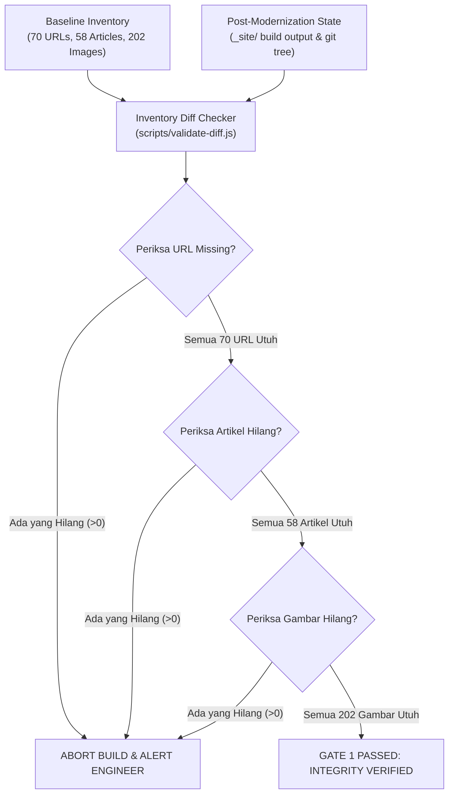

# MIGRATION SAFETY & PRESERVATION PROTOCOL
## Safeguarding Existing SEO Equity, Content, and Assets for Tran99.com

**Version:** 1.0.0  
**Principle:** PRESERVE FIRST, ENHANCE SECOND  
**Scope:** Controlled Modernization Layer (Non-Destructive)  

---

## 1. Pre-Migration Checklist (Checklist Pra-Migrasi)

Sebelum satu baris kode produksi pun diubah, seluruh poin verifikasi berikut wajib berstatus centang hijau:

- [x] **Git Status Bersih:** Working tree diverifikasi bebas dari uncommitted changes.
- [x] **Remote Up-to-Date:** Seluruh commit terbaru dari `origin/master` telah ditarik secara aman.
- [x] **Baseline Commit SHA Terkunci:** Commit `cf36a70f8d3dff97f7191790ad60e19f340a3887` tercatat permanen.
- [x] **Inventory Machine-Readable Terbuat:** 7 file inventaris JSON tersimpan di folder `inventory/` dan root.
- [x] **Audit Live Site Terlaksana:** Respon live `https://tran99.com` telah dianalisis.
- [ ] **Development Branch Terbuka:** Pekerjaan dialihkan ke `modernization/phase-3-adarent`.

---

## 2. Inventory Comparison Engine (Automated Safeguard)

Untuk memastikan tidak ada file, gambar, ID, atau URL yang terhapus secara sengaja maupun tidak sengaja, script otomatis `scripts/validate-diff.js` membandingkan kondisi pasca-build dengan file inventaris baseline:



---

## 3. Preservation Policies (Kebijakan Preservasi Ketat)

### 3.1 Kebijakan Preservasi Artikel Blog (58 Artikel)
1. **Existing File:** Tidak boleh ada penghapusan file `.md` di dalam `_posts/`.
2. **Existing Date:** Tanggal pada nama file (`YYYY-MM-DD`) dan frontmatter tidak boleh diubah untuk melindungi usia indeks (*index age*).
3. **Existing Slug & Permalink:** Struktur `/YYYY/MM/DD/slug/` adalah aset permanen yang tidak boleh dimodifikasi.
4. **Existing ID:** ID bawaan Jekyll dan identifier artikel dipertahankan 100%.
5. **No AI Mass-Rewriting:** Dilarang menggunakan model AI untuk menulis ulang seluruh konten artikel lama secara massal karena berpotensi merusak topical authority yang telah terindeks.

### 3.2 Kebijakan Preservasi Gambar & Media (202 Aset)
1. **Existing Path:** Seluruh jalur di `photos/`, `static/`, dan `images/` harus tetap valid.
2. **Existing Filename:** Dilarang me-rename nama file gambar (misal: `hiace-girl.jpg` dilarang diganti menjadi `hiace-surabaya.jpg`).
3. **No Batch Extension Conversion:** Dilarang mengonversi atau menghapus ekstensi file asli (`.jpg`, `.png`). Format modern seperti WebP/AVIF hanya boleh disediakan sebagai turunan komplementer (*additive optimization*), tanpa menghapus file sumber aslinya.

---

## 4. Rollback & Disaster Recovery Procedures

Jika terjadi kesalahan tak terduga selama pengujian atau pasca-deploy, prosedur pemulihan berikut dijamin mengembalikan kondisi website ke titik aman semula dalam waktu kurang dari 60 detik:

### Skenario 1: Pembatalan di Development Branch (Sebelum Deploy)
```bash
# Batalkan seluruh perubahan lokal dan kembali ke baseline commit
git checkout modernization/phase-3-adarent
git reset --hard cf36a70f8d3dff97f7191790ad60e19f340a3887
```

### Skenario 2: Rollback Pasca-Deploy di Production Branch
```bash
# Kembalikan master ke commit baseline teruji
git checkout master
git revert HEAD --no-edit
git push origin master
```

---

## 5. Post-Deployment Verification Checklist

Setelah approval `"DEPLOY APPROVED"` diberikan dan release di-deploy ke GitHub Pages:
1. [ ] Buka `https://tran99.com/` -> Periksa respons HTTP 200, hero title, dan tombol WhatsApp.
2. [ ] Buka `https://tran99.com/sitemap.xml` -> Verifikasi seluruh URL berformat `https://` absolut dan 404 tidak ada.
3. [ ] Buka `https://tran99.com/robots.txt` -> Verifikasi crawler tidak diblokir.
4. [ ] Buka sampel artikel 2018: `https://tran99.com/2018/04/12/beejay-bakau-resort/` -> Verifikasi 200 OK dan judul `<h1>`.
5. [ ] Buka sampel artikel 2026: `https://tran99.com/2026/04/10/sewa-mobil-mojoagung/` -> Verifikasi 200 OK.
6. [ ] Jalankan Google AMP Validator online -> Verifikasi status validasi hijau.
7. [ ] Uji klik floating WhatsApp di browser desktop dan ponsel -> Pastikan nomor `081330548581` terbuka dengan format pesan yang tepat.
