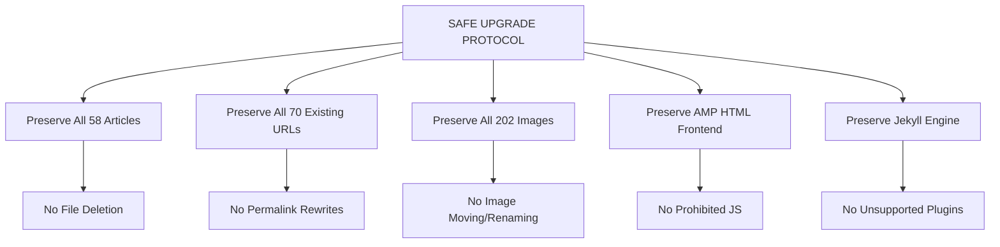

# PRODUCT REQUIREMENT DOCUMENT (PRD)
## Adarent CMS & Tran99.com Modernization Layer

**Version:** 1.0.0  
**Status:** Approved for Implementation  
**Project:** Adarent CMS / Tran99.com  
**Target Domain:** [https://tran99.com](https://tran99.com)  
**Repository:** [projecttran99/projecttran99.github.io](https://github.com/projecttran99/projecttran99.github.io)  
**Lead:** Principal Software Architect & Technical Lead  

---

## 1. Project Overview & Business Context

### 1.1 Context
Tran99.com adalah penyedia jasa rental dan sewa mobil terpercaya di Surabaya dan sekitarnya (Sidoarjo, Gresik, Malang, Bandara Juanda). Platform existing dibangun di atas Static Site Generator **Jekyll** dan di-host di **GitHub Pages** dengan antarmuka publik menggunakan **Google AMP HTML** murni.

### 1.2 Core Principle: SAFE UPGRADE, NOT REBUILD FROM ZERO
Modernisasi ini **bukan penulisan ulang dari nol** dan **bukan pergantian platform**. Proyek ini adalah peningkatan terkontrol (*controlled modernization layer*) yang melindungi seluruh aset digital yang telah dibangun sejak 2018:
- 58 artikel blog berbobot SEO
- 202 aset gambar lokal
- 70 URL terindeks di mesin pencari
- Seluruh struktur permalink `/:year/:month/:day/:slug/`
- Validasi kepatuhan penuh Google AMP HTML

---

## 2. Business & SEO Objectives

### 2.1 Business Objectives
1. Meningkatkan rasio konversi pengunjung menjadi prospek rental melalui *Call to Action* (CTA) WhatsApp dan telepon yang lebih responsif, cepat, dan mudah diakses.
2. Menyediakan antarmuka pengelolaan konten modern (**Adarent CMS**) agar pemilik bisnis dapat membuat, mengedit, dan mempublikasikan artikel serta armada kendaraan tanpa perlu mengedit file markdown mentah secara manual melalui GitHub web UI.
3. Meningkatkan kecepatan dan stabilitas website di perangkat mobile (yang mewakili >80% traffic rental mobil lokal).

### 2.2 Primary SEO Objectives
1. **Target Keyword Utama:**
   - *Rental Mobil Surabaya*
   - *Sewa Mobil Surabaya*
2. **Target Keyword Sekunder / Turunan:**
   - *Sewa Mobil Surabaya Murah*, *Rental Mobil Surabaya Lepas Kunci / dengan Driver*, *Sewa Mobil Bandara Juanda Surabaya*, *Rental Innova Reborn / Hiace / Fortuner Surabaya*, *Sewa Mobil Harian Surabaya*.
3. **Prinsip Utama:**
   - **Zero SEO Regression:** 0% broken URL, 0% kehilangan permalink, 0% kanonikal hilang.
   - **Helpful Content First:** Menolak keyword stuffing; membangun relevansi topikal, schema structured data yang valid, arsitektur informasi terstruktur, dan internal linking semantik.

---

## 3. Target Audience & User Personas

| Persona | Profil & Kebutuhan | Perilaku & Preferensi |
| :--- | :--- | :--- |
| **Budi (Wisatawan Keluarga)** | Wisatawan dari luar Surabaya yang butuh mobil nyaman (Innova/Avanza) + driver selama 3 hari. | Mengakses via smartphone, butuh kepastian harga instan dan tombol WhatsApp langsung. |
| **Sarah (Corporate Travel Manager)** | Eksekutif perusahaan yang membutuhkan armada representatif (Fortuner/Alphard/Hiace) dan invoice legal. | Butuh informasi kejelasan armada, syarat sewa, reputasi, dan fast-response admin. |
| **Denny (Content Editor & Admin)** | Pengelola operasional Tran99.com yang ingin memperbarui artikel wisata, tips sewa, dan daftar tarif armada. | Memerlukan dashboard CMS berbasis web yang intuitif, aman, dan menyimpan riwayat commit otomatis ke GitHub. |

---

## 4. Requirements Matrix

### 4.1 Functional Requirements (FR)

| ID | Requirement | Priority | Deskripsi |
| :--- | :--- | :--- | :--- |
| **FR-01** | **Jekyll Static Generation** | Critical | Tetap menggunakan Jekyll static engine yang didukung GitHub Pages tanpa plugin pihak ketiga yang tidak didukung. |
| **FR-02** | **100% AMP HTML Frontend** | Critical | Seluruh halaman publik (`/`, `/blog/`, `/contact/`, `/gallery/`, `/product/`, dan `/YYYY/MM/DD/slug/`) wajib berstatus valid Google AMP. |
| **FR-03** | **Permalink Preservation** | Critical | Seluruh permalink artikel wajib tetap pada pola `/:year/:month/:day/:slug/`. |
| **FR-04** | **Adarent CMS Dashboard** | High | Menyediakan antarmuka GUI Git-based CMS (Sveltia CMS / Decap CMS) pada rute `/admin/` terisolasi tanpa mempengaruhi frontend publik. |
| **FR-05** | **Dynamic CTA Floating Bar** | High | Tombol mengambang (Floating Action Button) WhatsApp dan Telpon yang patuh AMP dan tidak mengganggu navigasi. |
| **FR-06** | **Product & Fleet Catalog** | High | Halaman `/product/` menampilkan spesifikasi armada, fasilitas (driver/lepas kunci), dan harga terintegrasi WhatsApp template order. |
| **FR-07** | **Semantic Breadcrumb** | Medium | Komponen breadcrumb visual semantik dan JSON-LD `BreadcrumbList` pada artikel dan halaman sekunder. |
| **FR-08** | **SEO-Friendly Pagination** | Medium | Paginasi pada `/blog/` yang memecah artikel panjang dengan struktur crawlable dan kanonikal yang valid. |

### 4.2 Non-Functional Requirements (NFR)

| Kategori | Parameter | Target Metrik |
| :--- | :--- | :--- |
| **Performance** | Core Web Vitals (Mobile) | LCP < 2.0s, CLS = 0, INP < 150ms |
| **AMP CSS** | Bobot Inline `<style amp-custom>` | < 50.000 bytes (Batas absolut AMP: 75.000 bytes) |
| **Security** | Auth & Git Protection | HTTPS strictly enforced, CMS via GitHub OAuth token, master branch protected |
| **Accessibility** | Kepatuhan WCAG | WCAG 2.1 Level AA (Contrast ratio >= 4.5:1, aria-labels) |
| **SEO Quality** | Crawlability & Indexability | 100% link internal 200 OK, XML Sitemap absolut, Schema AutoRental valid |

---

## 5. Migration Constraints & Non-Negotiables

### 5.1 Larangan Keras (Must NOT):
- **DILARANG** menghapus artikel existing mana pun.
- **DILARANG** mengganti permalink atau slug artikel existing.
- **DILARANG** memindahkan lokasi gambar atau mengubah ekstensi gambar tanpa backward compatibility.
- **DILARANG** memasukkan JavaScript sembarangan (`<script>` custom) yang membatalkan validitas AMP.
- **DILARANG** melakukan `git push --force` ke remote origin.
- **DILARANG** melakukan merge atau push ke branch produksi `master` tanpa approval eksplisit kalimat: `"DEPLOY APPROVED"`.

---

## 6. Acceptance Criteria

Proyek modernisasi dinyatakan lulus dan siap deploy jika dan hanya jika:
1. [x] Baseline inventory lengkap tersimpan dan terverifikasi.
2. [ ] Build Jekyll lokal berhasil tanpa error atau warning kritis.
3. [ ] 100% halaman publik lulus validator Google AMP (`amphtml-validator`).
4. [ ] Seluruh 70 URL teruji mengembalikan kode status HTTP 200 (kecuali 404.html).
5. [ ] Seluruh 202 gambar terbukti dapat diakses tanpa broken link (404).
6. [ ] Sitemap XML menghasilkan URL absolut yang benar (`https://tran99.com/...`).
7. [ ] Tidak ada URL `/404.html` di dalam sitemap.xml.
8. [ ] Judul artikel di halaman post menggunakan tag `<h1>` yang valid.
9. [ ] Git diff review membuktikan tidak ada data atau metadata lama yang terhapus secara tidak sengaja.
10. [ ] Konfirmasi eksplisit `"DEPLOY APPROVED"` diterima dari Product Owner.

---

## 7. Out of Scope & Future Roadmap

### Out of Scope (Fase Sekarang):
- Pembuatan backend database relasional (PostgreSQL/MySQL) atau migrasi ke Next.js / Node.js backend.
- Payment gateway online payment otomatis (pemesanan tetap diarahkan ke WhatsApp Admin).
- Rewrite massal teks artikel menggunakan AI generatif tanpa review manual.

### Future Roadmap:
- Integrasi sistem booking kalender armada real-time (Fase 2).
- Optimasi gambar otomatis ke format WebP ganda dengan fallback tetap mempertahankan path JPEG/PNG asli (Fase 2).
- Pelacakan multi-bahasa jika target pasar internasional dibuka.
