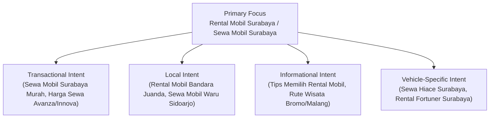
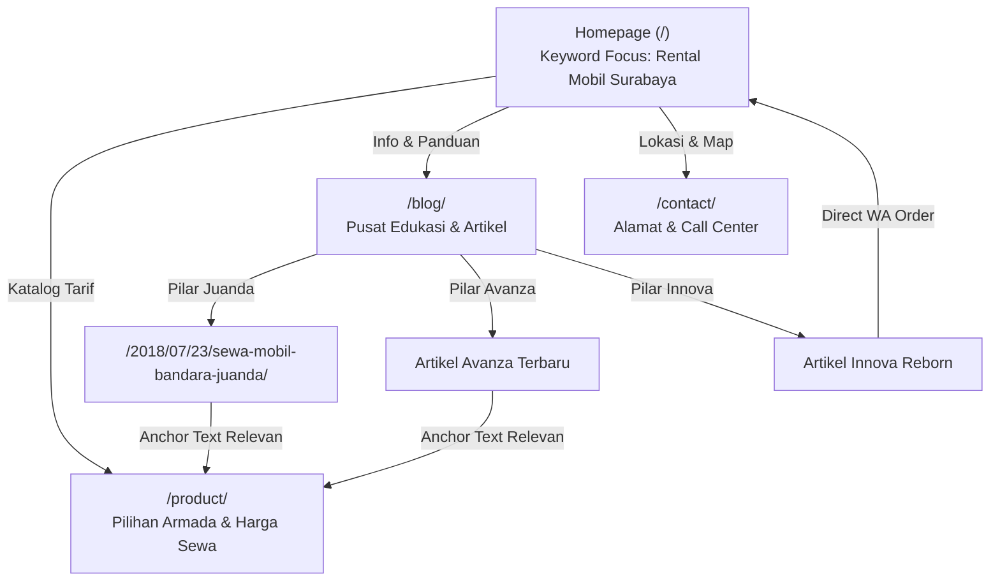

# TECHNICAL & LOCAL SEO SPECIFICATION
## Adarent CMS & Tran99.com Search Engine Optimization Blueprint

**Version:** 1.0.0  
**Target Search Market:** Google Indonesia (Surabaya, Sidoarjo, Jawa Timur)  
**Primary Keywords:** "Rental Mobil Surabaya", "Sewa Mobil Surabaya"  
**Mandatory Rule:** Jangan menjanjikan posisi ranking tertentu. Fokus utama adalah keunggulan teknis (*technical excellence*), relevansi semantik, kecepatan rendering, dan kepatuhan terhadap pedoman Google Search Central.

---

## 1. Keyword Strategy & Search Intent Mapping



| Kelompok Keyword | Contoh Keyword Spesifik | Search Intent | Target Landing Page | Format Konten |
| :--- | :--- | :--- | :--- | :--- |
| **Pilar Utama** | Rental Mobil Surabaya, Sewa Mobil Surabaya | Komersial / Transaksional | `/` (Homepage) | Hero USP, armada pilihan, SOP layanan, CTA WA |
| **Katalog Armada** | Harga sewa mobil surabaya, sewa innova reborn surabaya, sewa hiace surabaya | Transaksional | `/product/` | Tabel/kartu tarif, kapasitas penumpang, fasilitas driver |
| **Layanan Spesifik**| Sewa mobil bandara juanda, rental mobil bulanan surabaya | Komersial / Navigasional | `/2018/07/23/sewa-mobil-bandara-juanda/` | Panduan penjemputan airport, durasi sewa, armada siaga |
| **Topikal Edukasi** | Tips rental mobil surabaya, rute wisata jawa timur | Informasional | Artikel Blog `_posts/` | Artikel terstruktur, tips hemat, checklist inspeksi kendaraan |

---

## 2. Technical SEO Infrastructure

### 2.1 XML Sitemap Architecture (`sitemap.xml`)
- **Protokol:** Wajib menggunakan format URL absolut (`https://tran99.com/...`).
- **Aturan Pengecualian (Exclusion Filter):**
  - Mengeliminasi halaman error `/404.html`.
  - Mengeliminasi file XML internal (`feed.xml`, `sitemap.xml`).
  - Mengeliminasi halaman kosong hasil collection yang belum memiliki layout.
- **Frekuensi & Prioritas:**
  - Homepage (`/`): `priority: 1.0`, `changefreq: weekly`
  - Katalog Produk (`/product/`): `priority: 0.9`, `changefreq: weekly`
  - Blog & Artikel (`/YYYY/MM/DD/slug/`): `priority: 0.8`, `changefreq: monthly`
  - Kontak & Galeri: `priority: 0.6`, `changefreq: monthly`

### 2.2 Robots.txt (`robots.txt`)
- Memperbarui file `robots.txt` agar bersih dari sisa direktori WordPress (`/wp-admin`, `/wp-includes` jika sudah tidak ada URL lama yang memicu 404).
- Memastikan akses crawler Googlebot, Googlebot-Mobile, dan Googlebot-Image terbuka penuh tanpa blokir aset CSS/JS AMP:
  ```txt
  User-agent: *
  Allow: /
  Disallow: /admin/

  Sitemap: https://tran99.com/sitemap.xml
  ```

### 2.3 URL Canonicalization & Permalink Preservation
- Seluruh 58 artikel blog lama **DIJAMIN 100% UTUH** menggunakan struktur:
  `https://tran99.com/:year/:month/:day/:slug/`
- Tag `<link rel="canonical">` di-generate secara deterministik pada setiap halaman:
  `<link rel="canonical" href="{{ site.url }}{{ page.url | replace:'index.html','' }} /">`
- Tidak ada kanonikal relatif dan tidak ada kanonikal ganda.

---

## 3. On-Page SEO & Content Hierarchy

### 3.1 Heading Hierarchy Standards
Setiap halaman wajib mematuhi hierarki semantik W3C & SEO:

```
[h1] Judul Utama Halaman (Hanya Tepat 1 Elemen Per Halaman)
  ├── [h2] Sub-topik / Kategori Armada / Poin Utama Artikel
  │     └── [h3] Spesifikasi Armada / Sub-poin Pembahasan
  └── [h2] FAQ & Call to Action
```

- **Perbaikan Krusial:** Memperbaiki file `_layouts/post.html` di mana judul artikel sebelumnya dibungkus tag `<h3>`. Diubah menjadi `<h1>` standar.

### 3.2 Metadata & Open Graph Protocol (`_includes/metadata.html`)
- **Title Tag Formula:**
  - Halaman Post: `{{ page.title | default: page.text-title }} | Tran99.com`
  - Homepage: `Rental Mobil Surabaya, Sewa Mobil Surabaya | Tran99.com`
  - Katalog Produk: `Harga Sewa Rental Mobil Surabaya Terbaru | Tran99.com`
- **Meta Description:** Maksimal 155 karakter dengan kalimat persuasif mencakup call to action reservasi 24 jam.
- **Open Graph & Twitter Cards:**
  - `og:url`: Menunjuk ke URL kanonikal halaman individual (bukan statis homepage).
  - `og:image`: Menunjuk ke gambar unggulan artikel (`page.photos` atau `page.amp-img-scr`) dengan URL absolut HTTPS.
  - `og:type`: `"article"` untuk postingan, `"website"` untuk static pages.

---

## 4. Local SEO & Structured Data (JSON-LD)

### 4.1 Schema `AutoRental` & `LocalBusiness`
Menyematkan structured data JSON-LD yang kaya dan faktual sesuai data profil fisik Tran99:

```html
<script type="application/ld+json">
{
  "@context": "https://schema.org",
  "@type": "AutoRental",
  "@id": "https://tran99.com/#AutoRental",
  "name": "Tran99.com - Sewa & Rental Mobil Surabaya",
  "url": "https://tran99.com/",
  "logo": "https://tran99.com/static/rental-mobil-surabaya-tran99-logo.png",
  "image": "https://tran99.com/static/43913352_268369640351497_6468748527204336937_n.jpg",
  "telephone": "+6281330548581",
  "priceRange": "Rp 400.000 - Rp 1.800.000",
  "address": {
    "@type": "PostalAddress",
    "streetAddress": "Jalan Joyoboyo Kav C No 17",
    "addressLocality": "Medaeng, Waru, Sidoarjo",
    "addressRegion": "Jawa Timur",
    "postalCode": "61256",
    "addressCountry": "ID"
  },
  "geo": {
    "@type": "GeoCoordinates",
    "latitude": -7.3555956,
    "longitude": 112.7305617
  },
  "areaServed": [
    "Surabaya",
    "Sidoarjo",
    "Gresik",
    "Malang",
    "Bandara Internasional Juanda"
  ],
  "openingHoursSpecification": {
    "@type": "OpeningHoursSpecification",
    "dayOfWeek": [
      "Monday", "Tuesday", "Wednesday", "Thursday", "Friday", "Saturday", "Sunday"
    ],
    "opens": "00:00",
    "closes": "23:59"
  }
}
</script>
```

### 4.2 Schema `BreadcrumbList`
Menyediakan structured data hierarki navigasi pada setiap artikel blog:

```html
<script type="application/ld+json">
{
  "@context": "https://schema.org",
  "@type": "BreadcrumbList",
  "itemListElement": [
    {
      "@type": "ListItem",
      "position": 1,
      "name": "Beranda",
      "item": "https://tran99.com/"
    },
    {
      "@type": "ListItem",
      "position": 2,
      "name": "Info Blog",
      "item": "https://tran99.com/blog/"
    },
    {
      "@type": "ListItem",
      "position": 3,
      "name": "{{ page.text-title | escape }}",
      "item": "{{ site.url }}{{ page.url }}"
    }
  ]
}
</script>
```

---

## 5. Information Architecture & Internal Linking



### Pedoman Internal Linking:
1. Setiap artikel blog wajib menyertakan 1–2 tautan kontekstual ke `/product/` atau homepage dengan teks jangkar (*anchor text*) yang bervariasi dan alami (contoh: *"lihat tarif rental mobil Surabaya lengkap"*, *"pilihan sewa mobil keluarga"*).
2. Hindari broken links: Seluruh 764 internal link yang telah dipetakan pada inventory baseline diverifikasi secara otomatis sebelum deployment.
3. Hindari pembuatan doorway pages atau konten duplikat massal berbasis nama kecamatan/kelurahan tanpa nilai informasi yang nyata.

---

## 6. SEO Acceptance Criteria & Verification Matrix

| Kriteria | Metode Pengujian | Target Standar |
| :--- | :--- | :--- |
| **Kanonikal Valid** | Automated Test (`validate-seo.js`) | 100% halaman memiliki kanonikal absolut `https://tran99.com/...` |
| **Sitemap Absolut** | Parsing XML | 0 URL relatif, 0 entri `/404.html` |
| **Hierarki Heading** | DOM Inspector | Tepat 1 `<h1>` per halaman, tidak ada `<h3>` sebagai judul artikel utama |
| **Schema Validation** | Google Rich Results Test | Validasi `AutoRental` & `BreadcrumbList` tanpa error sintaks |
| **Status Kode HTTP** | Link Checker | 0 link internal berstatus 404/500 |
| **Meta Robots** | Header & Tag Check | `index, follow`, tidak ada direktori penting terblokir secara keliru |
