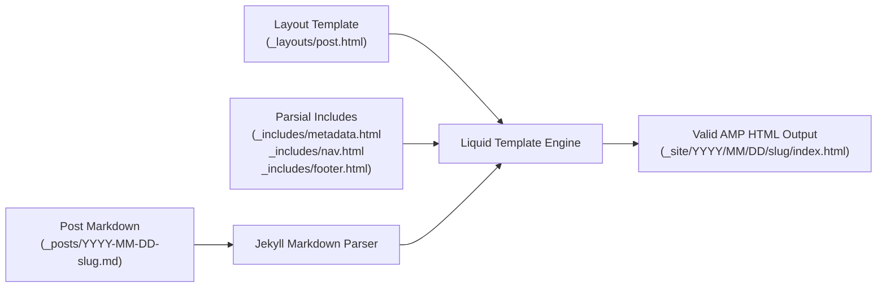
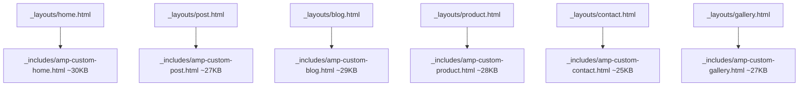
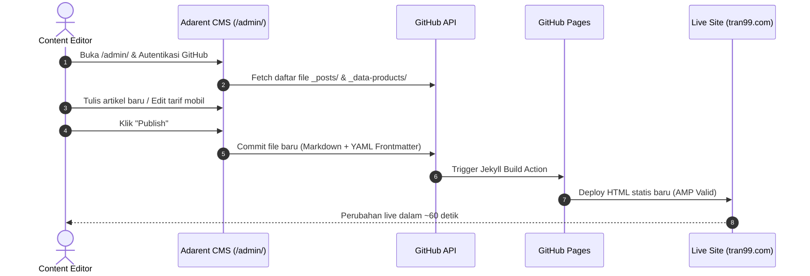
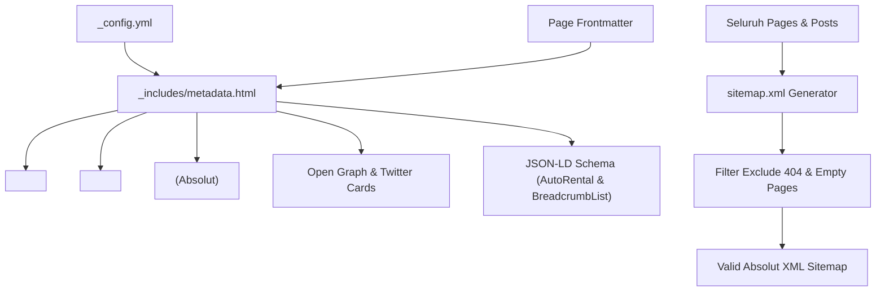

# TECHNICAL ARCHITECTURE SPECIFICATION
## Adarent CMS & Tran99.com System Architecture

**Version:** 1.0.0  
**Target Platform:** GitHub Pages (Static Hosting) + Sveltia CMS (Git-based Admin)  
**Public Frontend:** Google AMP HTML Engine  
**Static Generator:** Jekyll 4.x  

---

## 1. System Overview & High-Level Architecture

Platform Tran99.com beroperasi sebagai arsitektur *Jamstack* modern murni tanpa server database dinamis di sisi hosting publik. Lapisan manajemen konten (*Adarent CMS*) berkomunikasi langsung dengan repository GitHub via Git API, memicu static build otomatis pada GitHub Pages.

```mermaid
graph TD
    subgraph "Admin & Editor Layer"
        Editor[Content Editor / Denny] -->|Akses Web GUI| AdminUI["Adarent CMS (/admin/)<br>(Sveltia CMS Static SPA)"]
        AdminUI -->|GitHub REST API (OAuth)| RepoGit["GitHub Repository<br>(projecttran99.github.io)"]
    end

    subgraph "DevOps & Build Layer"
        RepoGit -->|Git Push Trigger| GHPages["GitHub Pages Build Pipeline<br>(Jekyll Static Generation)"]
        GHPages -->|Compile HTML + AMP| StaticDist["Production Static Distribution<br>(CDN Edge Servers)"]
    end

    subgraph "Public Client Layer"
        UserMobile[Pengunjung Mobile] -->|HTTPS GET| Edge["Fast CDN Edge (tran99.com)"]
        UserDesktop[Pengunjung Desktop] -->|HTTPS GET| Edge
        Edge -->|Serve Static AMP HTML| StaticDist
        Edge -->|Service Worker Cache| SW["Workbox Service Worker<br>(Offline / Precache)"]
    end
```

---

## 2. Jekyll & Content Architecture

### 2.1 Konfigurasi Jekyll & Liquid Pipeline
- **Engine:** Jekyll 4.4.1 (atau Jekyll build-in GitHub Pages).
- **Format Konten:** Markdown (.md) dengan YAML frontmatter.
- **Permalink Mode:** `permalink: pretty` -> Mengonversi `_posts/YYYY-MM-DD-slug.md` menjadi `/YYYY/MM/DD/slug/index.html`.
- **Collections Strategy:**
  - `_posts`: Berisi 58 artikel blog SEO.
  - `_data-products`: Data armada sewa mobil (Avanza, Innova, Hiace, Fortuner, Alphard).
  - `_data-section-*`: Potongan data modular untuk landing page homepage.



---

## 3. AMP HTML Architecture & Runtime

### 3.1 Komponen AMP & Mekanisme Validasi
Setiap halaman publik yang dihasilkan memenuhi spesifikasi ketat Google AMP:
1. Diawali dengan `<html ⚡ lang="id">` atau `<html amp lang="id">`.
2. Memuat AMP JS Library resmi: `<script async src="https://cdn.ampproject.org/v0.js"></script>`.
3. Memuat `<style amp-boilerplate>` standar.
4. Seluruh CSS kustom di-inline pada satu tag tunggal `<style amp-custom>` dengan batasan ukuran absolut **75.000 bytes**.
5. Tidak ada tag `<script>` kustom selain extension script resmi AMP (`amp-sidebar`, `amp-form`, `amp-instagram`, `amp-tiktok`, `amp-iframe`, `amp-install-serviceworker`).

### 3.2 Isolasi CSS Kustom Per Halaman
Untuk menjaga bobot CSS seminimal mungkin, setiap layout memuat include CSS yang disesuaikan:



---

## 4. Adarent CMS Architecture (Sveltia CMS Layer)

### 4.1 Mengapa Sveltia CMS?
Berdasarkan hasil audit teknis:
1. **Zero Backend Required:** Berjalan 100% di browser sisi klien sebagai static SPA di folder `/admin/index.html`.
2. **Kompatibilitas Penuh dengan Git:** Menggunakan format konfigurasi `admin/config.yml` yang kompatibel dengan Decap CMS namun jauh lebih ringan, cepat, dan modern (dibangun dengan Svelte).
3. **Penyimpanan Langsung:** Commit langsung ke branch development atau master melalui GitHub Personal Access Token (PAT) atau GitHub OAuth gateway.
4. **Keamanan Maksimal:** Tidak ada database yang rentan SQL Injection atau WordPress-style vulnerabilities.



---

## 5. SEO Generation Architecture



---

## 6. Security Boundaries & Protection Strategy

| Lapisan | Ancaman Potensial | Mitigasi Arsitektural |
| :--- | :--- | :--- |
| **Public Hosting** | DDoS, Web Defacement, SQLi | GitHub Pages CDN Edge, static files only, immutable deployment |
| **Frontend Execution** | XSS via Script Injection | Google AMP CSP (Content Security Policy) strictly blocks arbitrary JS |
| **Content Administration** | Akses admin ilegal | GitHub OAuth, akses write dibatasi oleh izin repository GitHub |
| **Version Control** | Force push destruktif / data loss | Branch protection rule pada `master`, rollback berbasis commit SHA |

---

## 7. Architectural Decisions & Trade-offs (ADR)

### ADR-01: Mempertahankan Jekyll & Tidak Migrasi ke Next.js / Astro
- **Konteks:** Website telah berjalan stabil di GitHub Pages dengan 58 artikel terindeks dan skor AMP valid.
- **Keputusan:** Tetap menggunakan Jekyll.
- **Trade-off:**
  - *Kelemahan:* Keterbatasan ekosistem plugin di GitHub Pages (hanya plugin resmi yang di-whitelist).
  - *Keuntungan:* Biaya hosting $0/bulan, keandalan uptime 99.99%, nol overhead server maintenance, dan resiko migrasi URL 0%.

### ADR-02: Memilih Sveltia CMS daripada Database CMS
- **Keputusan:** Menggunakan Sveltia CMS Git-based SPA pada `/admin/`.
- **Keuntungan:** Tidak perlu mengelola database MySQL/Postgres terpisah. Konten tetap berupa file Markdown yang dapat di-audit melalui `git diff`.
