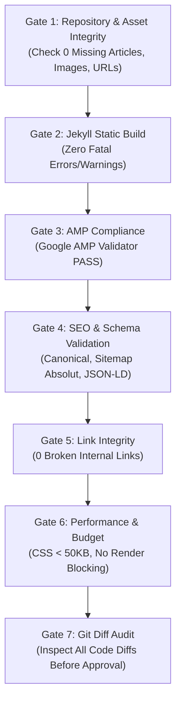

# TESTING & QUALITY ASSURANCE STRATEGY
## Adarent CMS & Tran99.com Comprehensive Test Plan

**Version:** 1.0.0  
**Methodology:** Automated Static Analysis, Build Tests, AMP Linting, and SEO Integrity Verification  
**Coverage Target:** 100% of Existing URLs, Articles, Assets, and AMP Templates  

---

## 1. Quality Gates Architecture

Semua perubahan wajib melewati 7 Quality Gates bertingkat sebelum dapat diajukan untuk review manusia:



---

## 2. Test Suites Detailed Specifications

### 2.1 Test Suite 1: Build & Generation Tests
- **Tujuan:** Memastikan parser Jekyll dan plugin feed menghasilkan direktori output `_site/` yang lengkap tanpa error sintaks Liquid.
- **Perintah:**
  ```bash
  bundle exec jekyll build --strict
  ```
- **Kriteria Lulus:** Exit code 0, tidak ada error tag Liquid yang tidak tertutup atau file hilang.

---

### 2.2 Test Suite 2: Google AMP HTML Validation
- **Tujuan:** Memastikan 100% markup yang dihasilkan diakui sebagai AMP HTML valid oleh Google Search.
- **Metode Pengujian:** Menggunakan script pengujian otomatis `scripts/validate-amp.js` berbasis `@ampproject/toolbox-validator` atau `amphtml-validator`.
- **Target Halaman:**
  - Homepage (`index.html`)
  - Katalog Produk (`product.html`)
  - Blog Listing (`blog.html`)
  - Kontak (`contact.html`)
  - Galeri (`gallery.html`)
  - Sampel artikel: 2018, 2020, 2023, 2026.
- **Kriteria Lulus:** 0 error AMP, atribut `src`, `width`, `height`, `layout` terdefinisi pada semua `<amp-img>`.

---

### 2.3 Test Suite 3: URL, Article, and Asset Integrity (Gate 1)
- **Tujuan:** Mencegah terjadinya 404 pada URL dan gambar yang telah terindeks sejak 2018.
- **Metode Pengujian:** Menjalankan script `scripts/validate-diff.js`:
  ```bash
  node scripts/validate-diff.js
  ```
- **Kriteria Lulus:**
  - Jumlah artikel `_posts/*.md` pasca-migrasi >= 58.
  - Jumlah file gambar di `photos/`, `static/`, `images/` >= 202.
  - Seluruh 70 URL baseline menghasilkan file HTML valid di `_site/`.

---

### 2.4 Test Suite 4: SEO & Structured Data Validation
- **Tujuan:** Memvalidasi kanonikal, hierarki heading, tag meta, dan skema JSON-LD.
- **Metode Pengujian:** `scripts/validate-seo.js`.
- **Poin Pemeriksaan:**
  1. Halaman post hanya memiliki tepat satu tag `<h1>`.
  2. Tag `<link rel="canonical">` memuat URL absolut `https://tran99.com/...`.
  3. Tag `og:url` memuat URL individual halaman (bukan statis homepage).
  4. Tag `sitemap.xml` memuat URL absolut dan tidak memuat `/404.html`.
  5. JSON-LD schema `AutoRental` dan `BreadcrumbList` lulus validasi skema Schema.org.

---

### 2.5 Test Suite 5: Internal Link & Asset Link Checker
- **Tujuan:** Memverifikasi seluruh 764 tautan internal tidak mengarah ke rute yang mati.
- **Kriteria Lulus:** 0 link internal berstatus 404.

---

### 2.6 Test Suite 6: Performance & CSS Budget Tests
- **Tujuan:** Memastikan performa tinggi dan kuota CSS tidak mendekati limit AMP.
- **Kriteria Lulus:**
  - Ukuran `<style amp-custom>` pada setiap layout < 50.000 bytes (limit 75.000 bytes).
  - Skor Lighthouse Mobile Performance >= 90.
  - Cumulative Layout Shift (CLS) = 0.

---

### 2.7 Test Suite 7: Accessibility & Responsive Design Tests
- **Kriteria Lulus:**
  - Rasio kontras teks utama minimal 4.5:1 (WCAG AA).
  - Semua tombol interaktif (burger menu, WhatsApp, telepon) memiliki `aria-label` atau teks visual yang jelas.
  - Tampilan mulus dan proporsional pada viewport 320px (iPhone SE), 375px (iPhone modern), 768px (Tablet), hingga 1440px (Desktop).

---

## 3. Automated Test Execution Commands

Perintah pengujian yang dibakukan untuk repositori:

| Perintah | Fungsi | Target Quality Gate |
| :--- | :--- | :--- |
| `npm run test:build` / `jekyll build` | Kompilasi statis Jekyll | Gate 2 |
| `npm run test:diff` | Cek diff inventaris baseline | Gate 1 & 7 |
| `npm run test:amp` | Validasi kepatuhan AMP HTML | Gate 3 |
| `npm run test:seo` | Validasi heading, sitemap, meta, schema | Gate 4 |
| `npm run test:all` | Menjalankan seluruh test pipeline | All Gates |
